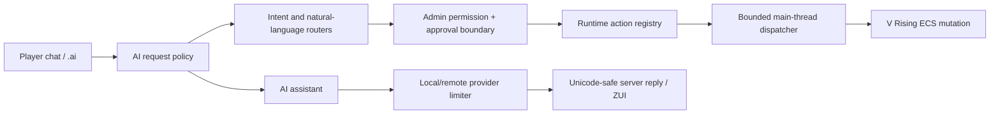
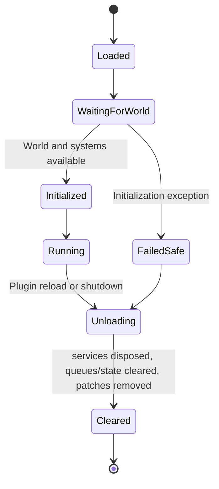
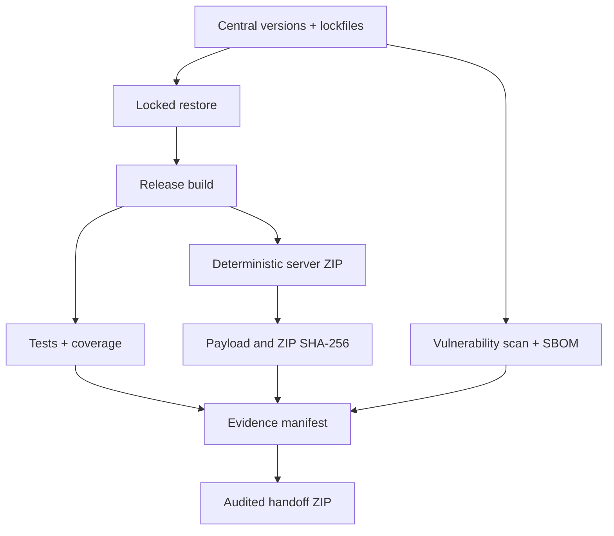

# Dependency, call-flow, and lifecycle diagrams

## Server request flow

```mermaid
flowchart LR
    Player["Player chat / .ai"] --> Guard["AI request policy"]
    Guard --> Router["Intent and natural-language routers"]
    Router --> Approval["Admin permission + approval boundary"]
    Approval --> Registry["Runtime action registry"]
    Registry --> Main["Bounded main-thread dispatcher"]
    Main --> ECS["V Rising ECS mutation"]
    Guard --> Assistant["AI assistant"]
    Assistant --> Provider["Local/remote provider limiter"]
    Provider --> Reply["Unicode-safe server reply / ZUI"]
```

## Plugin lifecycle

```mermaid
stateDiagram-v2
    [*] --> Loaded
    Loaded --> WaitingForWorld
    WaitingForWorld --> Initialized: World and systems available
    WaitingForWorld --> FailedSafe: Initialization exception
    Initialized --> Running
    Running --> Unloading: Plugin reload or shutdown
    FailedSafe --> Unloading
    Unloading --> Cleared: services disposed, queues/state cleared, patches removed
    Cleared --> [*]
```

## Release evidence chain

```mermaid
flowchart TD
    Locks["Central versions + lockfiles"] --> Restore["Locked restore"]
    Restore --> Build["Release build"]
    Build --> Tests["Tests + coverage"]
    Locks --> Scan["Vulnerability scan + SBOM"]
    Build --> Package["Deterministic server ZIP"]
    Package --> Checksums["Payload and ZIP SHA-256"]
    Tests --> Evidence["Evidence manifest"]
    Scan --> Evidence
    Checksums --> Evidence
    Evidence --> AuditZip["Audited handoff ZIP"]
```
