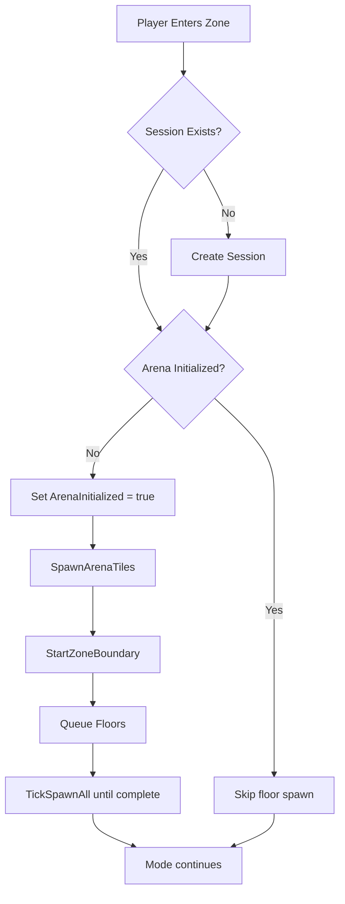

# BattleLuck Build Status

## Current State

Latest validated Release build status (May 24, 2026):

- Status: success
- Output: `bin/Release/net6.0/BattleLuck.dll`
- Errors: 0
- Warnings: 4 (NU1507 - multiple NuGet package sources)

## Typical Warnings

- `NU1507` (x2): multiple NuGet package sources without source mapping

## Resolved Warnings / Fixes

| Item | File | Detail |
|------|------|--------|
| `CS8602` | `SessionController.cs` | Added `zone != null` guard before `zone.ExitRadius` access in DOT boundary tick |
| Dead MSBuild condition | `BattleLuck.csproj` | `USERPROFILE` fallback for `VRisingServerRoot` was shadowed by the hardcoded Steam path — reordered so env-var → USERPROFILE → Steam default |
| CI deploy side-effect | `BattleLuck.csproj` | `BuildToServer` target now skips in GitHub Actions (`GITHUB_ACTIONS != true`) |
| Hardcoded mode list | `SessionController.cs` | `Initialize()` now iterates `_registry.GetRegisteredModes()` instead of a literal string array |
| Fixed-duration override | `SessionController.cs` | Session time limit now reads `MatchDurationMinutes` from `session.json`; falls back to 120 s only when the value is 0 |
| Respawn suppress | `SessionController.cs` | `_recentlyDied` changed from `HashSet` to `Dictionary<ulong,int>`; suppresses walk-out penalty for 3 ticks instead of 1 |
| Missing `Shutdown` cleanup | `SessionController.cs` | `_recentlyDied` is now cleared in `Shutdown()` |
| Optional config noise | `ConfigLoader.cs` | `kit.json` loaded with `optional: true`; missing optional files no longer emit a warning |
| Parse vs missing distinction | `ConfigLoader.cs` | `LoadJson` catches `JsonException` separately so parse errors always log a warning even for optional files |
| Thread visibility | `ConfigLoader.cs` | `_defaultsEnsured` marked `volatile` |
| Duplicate GUIDs | `Data/Prefabs.cs` | `VBlood_Alpha_Wolf`, `VBlood_Leandra`, `AB_Vampire_PrimaryAttack_AbilityGroup`, `Buff_Vampire_Exposed` marked with `⚠ DUPLICATE` — correct values must be verified against live game data |

## Build Command

```powershell
dotnet build "BattleLuck.sln" -c Release
```

## Notes

- Build duration in this run: ~2.28s
- AI sidecar build/runtime is separate from the C# mod build.

## Floor Spawn Flow



### Top View (Concept)

```text
  F F F F F F
  F         F
  F        F
  F         F
  F    Flors inside only     F
  F         F
  F         F
  F         F
  F  WALLS AND BUFFS IN BORDERS 
         F
  F         F
  F         F
  F F F F F F

F = floor fill tiles
C = zone/platform center
```

### Behavior Summary

- Floors are initialized once per session, on first player entry.
- Later players entering the same active session do not respawn floors.
- Floors are despawned when the session ends.
